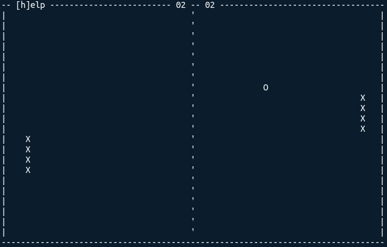

# termpong

A basic command line version of the Pong game in Rust.

## Build

Build using Cargo:

    $ cargo build --release
    3.1M target/release/termpong

The executable still contains a lot of debug symbols. On Linux, they can be removed with strip:

    $ strip target/release/termpong
    463K target/release/termpong

